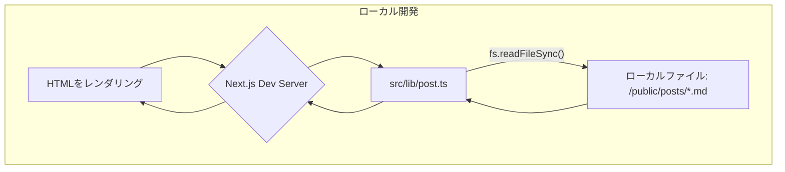
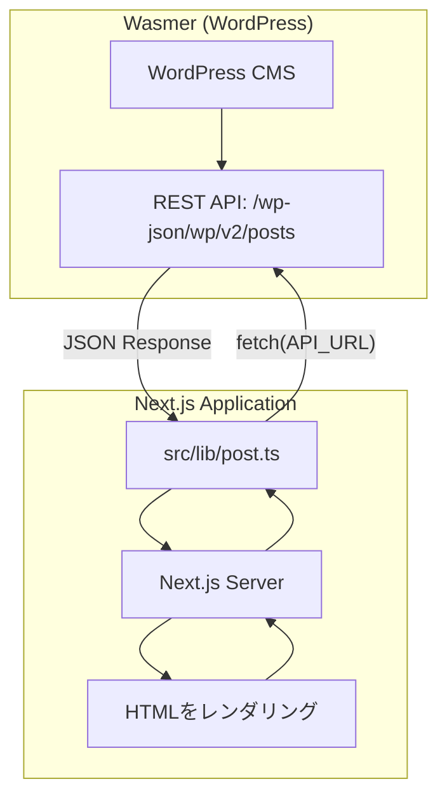

# ブログコンテンツ管理構成まとめ

## 現在の構成: ローカルファイルベース

現在のブログシステムは、ローカルのMarkdownファイルを原本とし、開発環境・本番環境ともに同じ仕組みでデータを取得するシンプルな構成です。

- 全環境共通: `/public/posts/` にあるMarkdownファイルを直接読み込みます。
- ビルド時処理: `scripts/generate-posts-index.js` でパフォーマンス最適化用のインデックスファイルを生成します。

---

### データフロー

#### 1. 開発環境 (`pnpm dev`)



#### 2. ビルド＆本番環境

```mermaid
graph TD
    subgraph "ビルドプロセス"
        A[/public/posts/*.md] --> B{pnpm build};
        B --> C[scripts/generate-posts-index.js];
        C --> D[/public/posts/index.json 生成];
        B --> E[Next.js Build];
        E --> F[静的ファイル生成];
    end

    subgraph "本番環境"
        G[ユーザー] --> H[本番サーバー];
        H --> I[src/lib/post.ts];
        I -- "fs.readFileSync()" --> J[/public/posts/*.md];
        I -- "fs.readFileSync()" --> K[/public/posts/index.json];
        J --> I;
        K --> I;
        I --> H;
        H --> G[HTMLをレンダリング];
    end
```

---

### 現在の実装詳細

#### スクリプト: `scripts/generate-posts-index.js`

- 実行タイミング: `pnpm build` 時に自動実行されます。
- 主な機能:
  - MDファイルのfrontmatterを解析します。
  - `isPublished: true` の記事のみを抽出します。
  - バージョン管理機能（`.version-cache.json`）を持ちます。
  - 作成日時順にソートします。
  - `index.json` ファイルを生成します。

#### 型定義: `src/types/post.ts`

```typescript
export type Post = {
  slug: string
  formattedData: {
    title: string
    createdAt: string
    updatedAt: string
    thumbnail: string
  }
  content: string
}

export type PostIndex = {
  slug: string
  title: string
  createdAt: string
  updatedAt: string
  thumbnail: string
  version: number
}
```

#### コアロジック: `src/lib/post.ts`

```typescript
// 現在はシンプルなローカルファイル読み込み
async function fetchPostContent(slug: string): Promise<string | undefined> {
  const postPath = path.join(process.cwd(), 'public/posts', `${slug}.md`)
  return fs.readFileSync(postPath, 'utf-8')
}

async function fetchPostsIndex(): Promise<PostIndex[] | undefined> {
  const indexPath = path.join(process.cwd(), 'public/posts/index.json')
  const content = fs.readFileSync(indexPath, 'utf-8')
  return JSON.parse(content)
}
```

---

## 将来の構成案: Wasmer + WordPress API

現在のローカルファイルベースから、WasmerでホストするWordPress APIを利用する構成への移行を計画しています。

### 移行後のデータフロー



### Wasmer WordPress セットアップ手順

1.  Wasmerアカウントを作成します。
2.  Wasmer HubのWordPressテンプレートを利用してデプロイします。
3.  管理画面 (`/wp-admin`) で初期設定（サイト名、パーマリンク等）を完了させます。
4.  `curl https://your-site.wasmer.app/wp-json/wp/v2/posts` などでAPIの動作を確認します。

### Next.js側の実装変更

#### 環境変数設定

```bash
# .env.local
WORDPRESS_API_URL=https://your-site.wasmer.app/wp-json/wp/v2
```

#### `src/lib/post.ts` の更新

```typescript
const API_URL = process.env.WORDPRESS_API_URL;

// WordPress APIからのレスポンス型
type WordPressPost = { /* ... */ };

export const getAllPostsIndex = async (): Promise<PostIndex[]> => {
  const response = await fetch(`${API_URL}/posts?_embed`);
  const posts: WordPressPost[] = await response.json();
  // postsをPostIndex[]にマッピングする
  return posts.map(post => ({ /* ... */ }));
};

export const getPostBySlug = async (slug: string): Promise<Post | undefined> => {
  const response = await fetch(`${API_URL}/posts?slug=${slug}&_embed`);
  const posts: WordPressPost[] = await response.json();
  // postをPost型にマッピングする
  return { /* ... */ };
};
```

---

### 段階的移行プラン

#### Phase 1: WordPress 環境のセットアップと検証 (1-2日)
ゴール: Wasmer上でWordPressを稼働させ、API経由で記事データを取得できることを確認する。

- [ ] 1. Wasmerアカウント作成とCLIログイン
- [ ] 2. WordPressのデプロイ
- [ ] 3. WordPress初期設定（特にパーマリンク設定を「投稿名」に）
- [ ] 4. API動作確認（テスト記事作成、`_embed`パラメータの確認）
- [ ] 5. `.env` に環境変数を準備 (`WORDPRESS_API_URL`, `CMS_SOURCE_SWITCH`)

#### Phase 2: Next.js アプリケーションの実装 (2-3日)
ゴール: Next.js側でWordPress APIからデータを取得するロジックを実装し、環境変数でデータソースを切り替えられるようにする。

- [ ] 1. データソース切り替え機能の実装 (`src/lib/post.ts`)
- [ ] 2. WordPress APIクライアントの実装 (`src/lib/wordpress-client.ts`)
- [ ] 3. UIコンポーネントの互換性確認（スタイル崩れなど）
- [ ] 4. ビルドスクリプトの条件分岐 (`package.json`)

#### Phase 3: コンテンツ移行と本番リリース (1-2日)
ゴール: 既存記事をWordPressに移行し、本番環境をWordPress API参照に切り替える。

- [ ] 1. 既存Markdown記事の移行
- [ ] 2. 本番環境の準備（Cloudflare Pagesの環境変数設定）
- [ ] 3. ステージング環境での最終確認
- [ ] 4. 本番デプロイ
- [ ] 5. 旧資産のクリーンアップ（Markdownファイル、生成スクリプト等の削除）

---

### Q&A

- Q: パフォーマンスは大丈夫？
  - A: Next.jsのISR（Incremental Static Regeneration）でキャッシュし、必要に応じてCDNを導入します。

- Q: コスト面は？
  - A: Wasmerの無料プランで開始し、アクセス増加に応じてスケールアップを検討します。

- Q: 既存コンポーネントへの影響は？
  - A: `Post`・`PostIndex`型は維持するため、UI側の大きな変更は不要な想定です。

- Q: 障害時のフォールバック対応は？
  - A: 環境変数を切り替えることで、一時的にローカルファイル参照に戻すことが可能です。

- Q: WordPress管理画面へのアクセス制御は？
  - A: Wasmerの設定でIP制限やBasic認証を追加するか、WordPress側でセキュリティプラグインを導入します。

---

### 技術スタック

- フロントエンド: Next.js 15 (App Router)
- スタイリング: Tailwind CSS
- コンテンツ: Markdown ファイル → WordPress API
- データ取得: ローカルファイル (fs) → REST API (fetch)
- インデックス: `scripts/generate-posts-index.js` → WordPress API
- 型安全性: TypeScript + Zod
