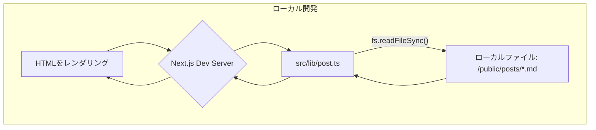
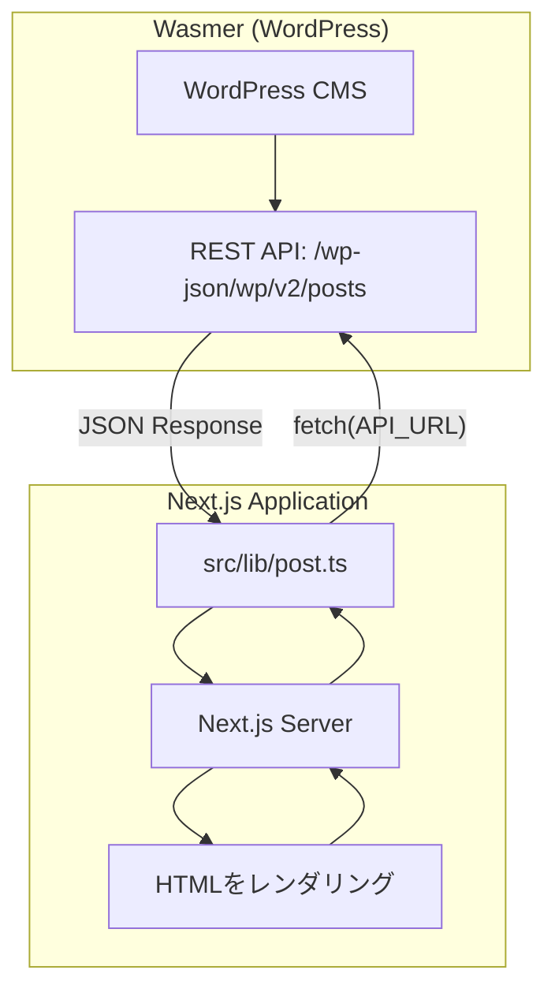

# ブログコンテンツ管理構成まとめ

## 🧩 現在の構成: ローカルファイルベースのシンプル構成

現在のブログシステムは、ローカルのMarkdownファイルを原本とし、開発環境・本番環境ともに同じ仕組みでデータを取得するシンプルな構成を採用しています。

-   **全環境共通**: `/public/posts/` にあるMarkdownファイルを直接読み込み
-   **ビルド時処理**: `scripts/generate-posts-index.js` でパフォーマンス最適化用のインデックスファイルを生成

---

### ✅ データフローの詳細

#### 1. 開発環境 (`pnpm dev`)



#### 2. ビルド＆本番環境

```mermaid
graph TD
    subgraph "ビルドプロセス"
        A[/public/posts/*.md] --> B{pnpm build};
        B --> C[scripts/generate-posts-index.js];
        C --> D[/public/posts/index.json 生成];
        B --> E[Next.js Build];
        E --> F[静的ファイル生成];
    end

    subgraph "本番環境"
        G[ユーザー] --> H[本番サーバー];
        H --> I[src/lib/post.ts];
        I -- "fs.readFileSync()" --> J[/public/posts/*.md];
        I -- "fs.readFileSync()" --> K[/public/posts/index.json];
        J --> I;
        K --> I;
        I --> H;
        H --> G[HTMLをレンダリング];
    end
```

---

### ✅ 現在の実装詳細

#### スクリプト (`scripts/generate-posts-index.js`)

- **実行タイミング**: `pnpm build` 時に自動実行
- **主な機能**:
  - MDファイルのfrontmatterを解析
  - `isPublished: true` の記事のみを抽出
  - バージョン管理機能（`.version-cache.json`）
  - 作成日時順のソート
  - `index.json` ファイルの生成

#### 型定義 (`src/types/post.ts`)

```typescript
export type Post = {
  slug: string
  formattedData: {
    title: string
    createdAt: string
    updatedAt: string
    thumbnail: string
  }
  content: string
}

export type PostIndex = {
  slug: string
  title: string
  createdAt: string
  updatedAt: string
  thumbnail: string
  version: number
}
```

#### コアロジック (`src/lib/post.ts`)

```typescript
// 現在の実装（シンプルなローカルファイル読み込み）
function getAssetsBinding() {
  // 実際にはCloudflare環境の検知を行うが、
  // 現在の本番環境では使用されていない
  return null
}

// ファイル取得の抽象化
async function fetchPostContent(slug: string): Promise<string | undefined> {
  // 現在は fs.readFileSync() でローカルファイルを直接読み込み
  const postPath = path.join(process.cwd(), 'public/posts', `${slug}.md`)
  return fs.readFileSync(postPath, 'utf-8')
}

async function fetchPostsIndex(): Promise<PostIndex[] | undefined> {
  // scripts/generate-posts-index.js で生成されたindex.jsonを読み込み
  const indexPath = path.join(process.cwd(), 'public/posts/index.json')
  const content = fs.readFileSync(indexPath, 'utf-8')
  return JSON.parse(content)
}

// 公開API
export const getAllPostsIndex = async (): Promise<PostIndex[]>
export const getPostBySlug = async (slug: string): Promise<Post | undefined>
```

---

## 🚀 実装予定: Wasmer + WordPress API構成

**現在のローカルファイルベースから、WasmerでホストするWordPress APIに移行します。**

### ✅ 移行後のデータフロー



### ✅ Wasmer WordPress セットアップ手順

1. **Wasmerアカウント作成**
   ```bash
   # https://wasmer.io/ でアカウント作成
   ```

2. **WordPressデプロイ**
   ```bash
   # Wasmer Hub の WordPress テンプレートを使用
   # https://hub.wasmer.io/wasmer/wordpress
   wasmer deploy --template wordpress
   ```

3. **WordPress初期設定**
   - 管理画面 (`/wp-admin`) でログイン
   - 基本設定（サイト名、パーマリンク等）
   - REST API有効化（デフォルトで有効）

4. **API設定確認**
   ```bash
   # REST APIのテスト
   curl https://your-site.wasmer.app/wp-json/wp/v2/posts
   ```

### ✅ Next.js側の実装変更

#### 環境変数設定

```bash
# .env.local
WORDPRESS_API_URL=https://your-site.wasmer.app/wp-json/wp/v2
```

#### `src/lib/post.ts` の更新

```typescript
const API_URL = process.env.WORDPRESS_API_URL || 'https://your-site.wasmer.app/wp-json/wp/v2'

// WordPress APIからのレスポンス型
type WordPressPost = {
  id: number
  slug: string
  title: { rendered: string }
  content: { rendered: string }
  date: string
  modified: string
  featured_media?: number
  _embedded?: {
    'wp:featuredmedia'?: Array<{
      source_url: string
    }>
  }
}

export const getAllPostsIndex = async (): Promise<PostIndex[]> => {
  try {
    const response = await fetch(`${API_URL}/posts?_embed&per_page=100&status=publish`)

    if (!response.ok) {
      console.error('Failed to fetch posts:', response.status)
      return []
    }

    const posts: WordPressPost[] = await response.json()

    return posts.map(post => ({
      slug: post.slug,
      title: post.title.rendered,
      createdAt: post.date.slice(0, 10),
      updatedAt: post.modified.slice(0, 10),
      thumbnail: extractThumbnail(post),
      version: 1,
    }))
  } catch (error) {
    console.error('Error fetching posts:', error)
    return []
  }
}

export const getPostBySlug = async (slug: string): Promise<Post | undefined> => {
  try {
    const response = await fetch(`${API_URL}/posts?slug=${slug}&_embed`)

    if (!response.ok) {
      return undefined
    }

    const posts: WordPressPost[] = await response.json()
    if (posts.length === 0) return undefined

    const post = posts[0]

    return {
      slug: post.slug,
      formattedData: {
        title: post.title.rendered,
        createdAt: post.date.slice(0, 10),
        updatedAt: post.modified.slice(0, 10),
        thumbnail: extractThumbnail(post),
      },
      content: post.content.rendered,
    }
  } catch (error) {
    console.error('Error fetching post:', error)
    return undefined
  }
}

function extractThumbnail(post: WordPressPost): string {
  // アイキャッチ画像の取得
  const featuredMedia = post._embedded?.['wp:featuredmedia']?.[0]
  return featuredMedia?.source_url || '/images/pencil01.svg'
}
```

### ✅ 段階的移行プラン

#### Phase 1: 環境構築
- [ ] Wasmer でWordPressサイト作成
- [ ] 管理画面での基本設定
- [ ] サンプル記事作成・API動作確認

#### Phase 2: 開発環境での実装
- [ ] `src/lib/post.ts` のAPI版実装
- [ ] 環境変数による切り替え機能
- [ ] エラーハンドリング・フォールバック機能

#### Phase 3: 本番移行
- [ ] 既存記事のWordPressへのインポート
- [ ] DNS切り替え・デプロイ
- [ ] 旧システムの段階的廃止

---

### ✅ Q&A

- **Q. パフォーマンスは大丈夫？**
  - A. Next.jsのISR（Incremental Static Regeneration）でキャッシュ、必要に応じてCDN導入

- **Q. コスト面は？**
  - A. Wasmer無料プランで開始、アクセス増加に応じてスケールアップ

- **Q. 既存コンポーネントへの影響は？**
  - A. `Post`・`PostIndex`型は維持するため、UI側の変更は不要

- **Q. 障害時のフォールバック対応は？**
  - A. 環境変数での切り替えで、一時的にローカルファイルに戻すことが可能

- **Q. WordPress管理画面へのアクセス制御は？**
  - A. Wasmerの設定でIP制限・Basic認証の追加、またはWP側でプラグイン導入

---

### ✅ 現在の技術スタック

- **フロントエンド**: Next.js 15 (App Router)
- **スタイリング**: Tailwind CSS
- **コンテンツ**: Markdown ファイル (frontmatter + 本文) → **WordPress API**
- **データ取得**: ローカルファイル (fs) → **REST API (fetch)**
- **インデックス**: scripts/generate-posts-index.js → **WordPress API**
- **型安全性**: TypeScript + Zod バリデーション（継続）
